# How do we chooe a prior?

## Suppose you say that it is a fair coin

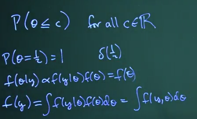

The prior can be seen as a CFD (cumulative distribution function) that encodes our beliefs about the parameters before seeing the data.

We should not choose a prior with degenarate support (e.g., a prior that puts all its mass on a single point)

## Suppose you say that you have no idea about the coin
Suppose we tost a coin and we want to model the probability of how many heads we get. $ X = \sum_{i=1}^{n} Y_i $ where $ Y_i \sim Bernoulli(\theta) $.
Lets say we have no idea about the coin, we can use a uniform prior $ \theta \sim Beta(1,1) = Uniform(0,1) $.

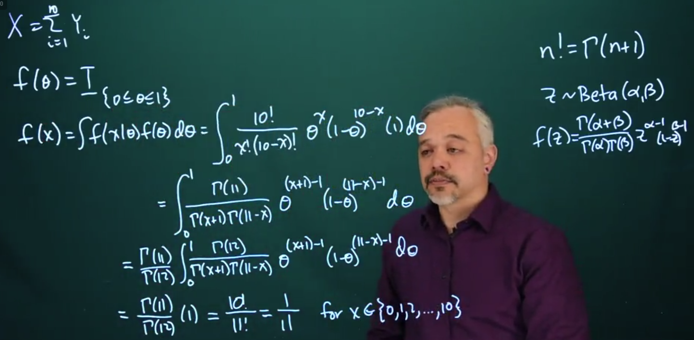

## What after we observe some data?

Suppose we toss it and in the first flip we get a head. Now we can update our prior to get the posterior.
$ f_{y_1, y_2}(y_1 | y_2) = \int_{0}^{1} f(y_2 |\theta, y_1 ) f_{\theta}(\theta | y_1) d\theta $
We are not using the prior anymore, we are using the posterior as our new belief about the parameter.

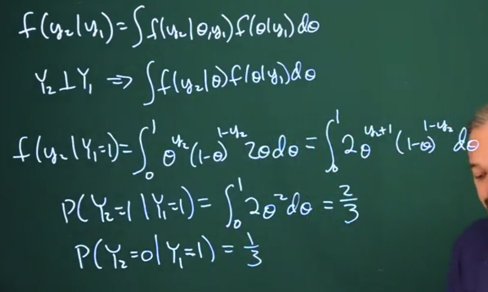

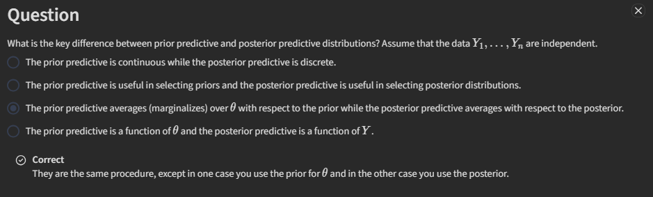

# Conjugate Priors

## Bernoulli and Binomial Data

When we use a uniform prior, for a Bernoulli likelihood, the posterior is a Beta distribution.

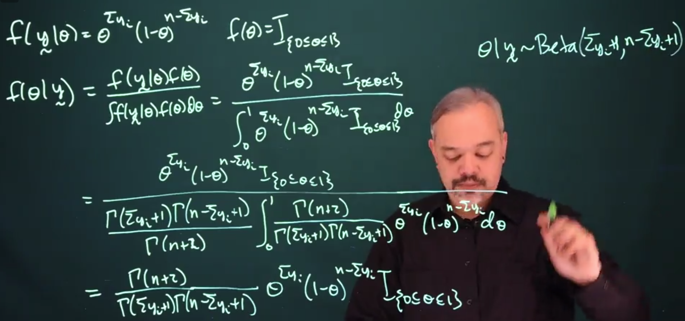

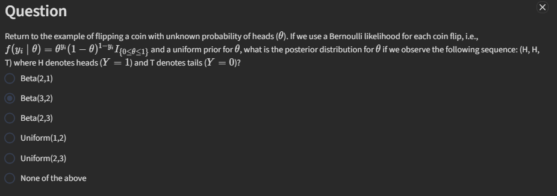

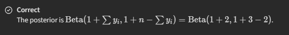

## Conjugate Priors

Remember that an uniform distrbiution is a special case of a Beta distribution, $ Beta(1,1) = Uniform(0,1) $. And any beta distribution, is conjugate for the Bernoulli distribution. Any beta prior, will give a beta posterior.

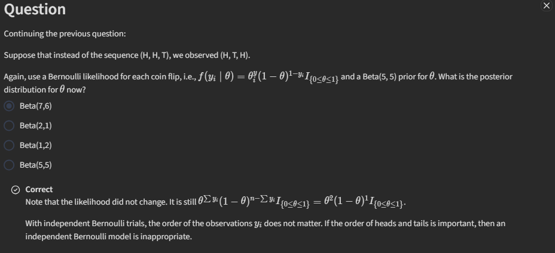

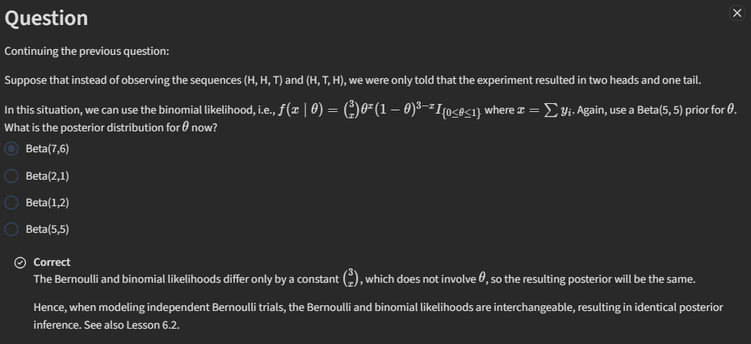

 But this whole concept now of starting with the beta prior and getting a beta posterior is a really convenient one. This whole process where we choose a particular form of prior that works with a likelihood is called using a conjugate family.
 A family of distributions is referred to as conjugate if when you use a member of that family as a prior, you get another member of that family as your posterior.
 The beta distribution is conjugate for the Bernoulli distribution. It's also conjugate for the binomial distribution.

 sticking to conjugate families allows us to get closed form solutions. If the family is flexible enough, then you can find a member of that family that closely enough represents your beliefs. We can represent this model as a hierarchy.

 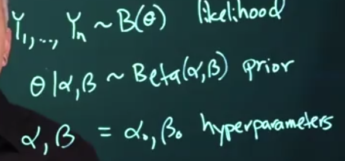

  Typically in what we will be doing here is we'll set this equal to particular values. But in a more complicated problem you might also want to have more flexibility by putting priors on L foot and or Beta. We can just extend this hierarchy to more levels. In complicated problems this may provide some added value and added flexibility. In simple problems this tends to be more work without providing much additional value.

## Posterior mean and effective sample size

 The posterior mean is a weighted average of the prior mean and the sample mean. The weights are determined by the effective sample size of the prior and the actual sample size.
If alpha + beta is large relative to n, then your posterior will be largely driven by the prior.

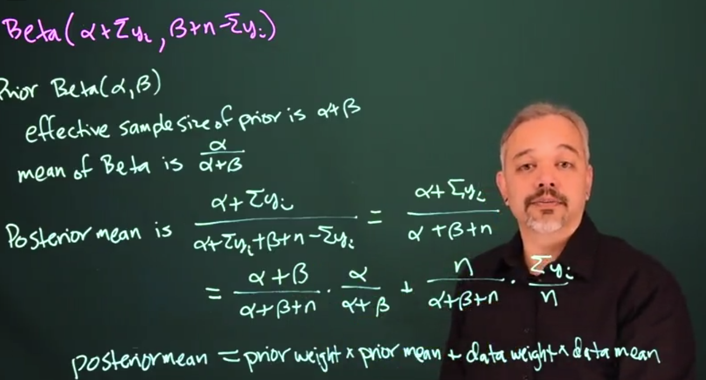
  
  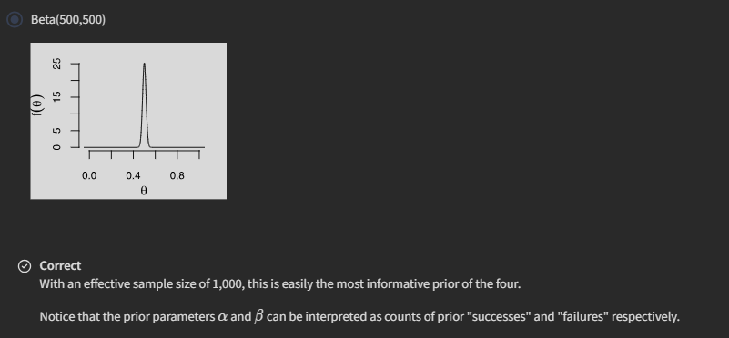

   Thinking about intervals, recall that a frequentist 95% confidence interval, For theta Is theta hat plus or minus 1.96 times the square root of theta hat, 1 minus theta hat over n. Now as a Bayesian, we can make a 95% credible interval using our posterior distribution for theta. We would use a computer package, such as R. To numerically find the values for the interval, we can find an interval that actually has 95% probability of containing theta. And this is a true probability statement.
For a confidence interval, we can't make a probability statement that theta is in the interval.

Sequential updating Suppose we have a prior distribution for theta, and we observe some data, and we get a posterior distribution for theta. Now suppose we observe some more data. We can use the posterior from the first update as the prior for the second update. This is called sequential updating.

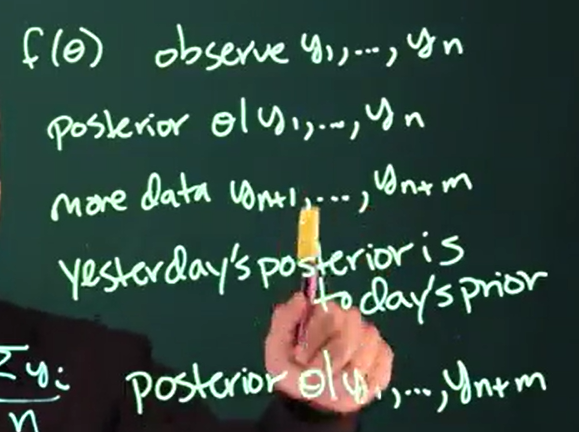

## Poisson Process and Gamma Prior

The Poisson process is a model for counting the number of events that occur in a fixed interval of time or space. The number of events in the interval follows a Poisson distribution with parameter lambda times t, where lambda is the rate of events per unit time or space, and t is the length of the interval.

Let's consider Poisson data. For example, think about chocolate chip cookies. In mass produced chocolate chip cookies, they make a large amount of dough. They mix in a large number of chips, mix it up really well and then chunk out individual cookies. In this process the number of chips per cookie approximately falls a Poisson distribution

Remember thath the the Poission has distribution has a pmf
$$ P(X = x | \lambda) = \frac{e^{-\lambda} \lambda^x}{x!} $$

What type of prior should we put on lambda? It would be convenient if we could use a conjugate prior. So we can ask, what distribution looks like lambda to the something e to the minus something lambda? 

The gamma distribution is a conjugate prior for the Poisson distribution. If we have a gamma prior for lambda, and we observe some data from a Poisson process, then the posterior distribution for lambda will also be a gamma distribution.

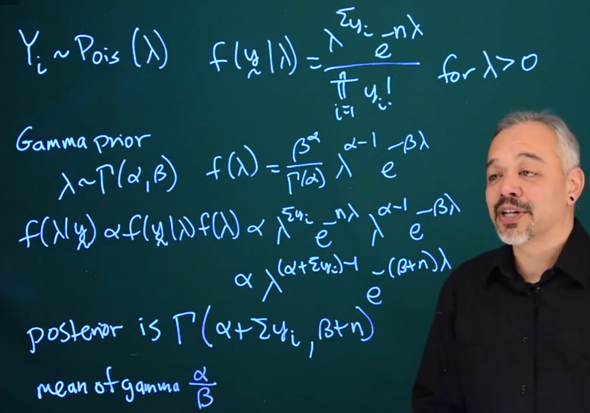

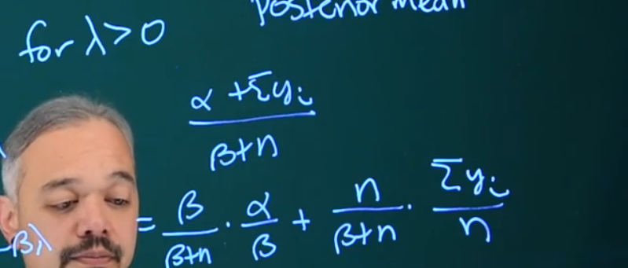

 We can now ask how would we choose our parameters, our hyper parameters alpha and beta? 

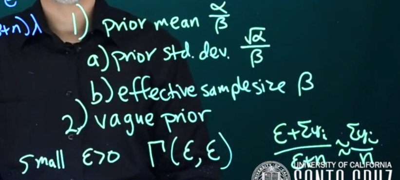

 Another way of specifying our confidence or uncertainty in our prior is to think about the effective sample size. As we see here, the effective sample size is beta. And so we can specify how many units of information, we think we have in our prior. How sure we are in that sense versus how confident we will be when we have n more data points? So we can specify a value for beta, and we can specify a prior mean and solve for alpha. 

  Another approach is that we can represent ignorance with a vague prior. In Bayesian statistics, a vague prior refers to one that's relatively flat across much of the space. In this case, we can think about some small epsilon. So epsilon is some small number that is strictly positive. And then we can have a gamma prior with parameters, epsilon and epsilon. As long as these are both strictly positive, this is a proper prior, it's a proper distribution. 
In this case then, the mean will be epsilon over epsilon which is 1, but its variannce will be huge,

 If epsilon is really small then this is approximately the sum of the y sub is over n, just the data mean. And thus the posterior will be largely driven by the data and the prior will have very little influence.

 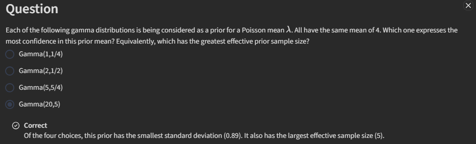